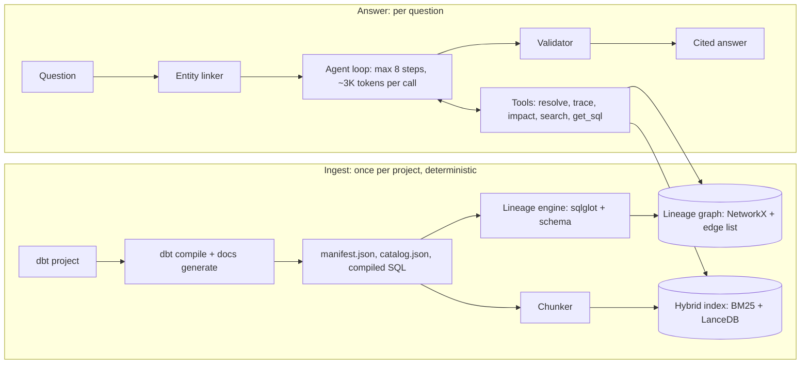

# DLens — Final Spec and Build Plan (v1.5)

**Version:** 1.5, 3 Oct 2026 (v1.4 plus timeline pulled forward after v0.1 shipped; change-log row 18). Supersedes the 30 Sep 2026 handoff report (v1.0).
**Owner:** Harshith. **Builder tools:** Claude Code (code), Claude app (mentor, review, docs).
**Save as:** `docs/DLENS_SPEC.md` in the repo. This file is the single source of truth. Where any older draft (including the MetricTrace drafts) disagrees, this file wins.

---

## 0. What changed from v1.0, and why

Each change below was decided on 3 Oct 2026 after research. Rows 1–8 become ADRs 0001–0008 in week 2 (Section 14).

| # | Change | Reason |
|---|---|---|
| 1 | **Primary LLM is Gemini Flash-Lite, not Flash.** Its daily budget is set from the limits AI Studio shows in week 0 | Google no longer publishes fixed free limits; they show per project in AI Studio ([rate limits](https://ai.google.dev/gemini-api/docs/rate-limits)). Recent reports put the newest Flash models at about 20 requests/day and Flash-Lite at about 500/day ([scriptbyai](https://www.scriptbyai.com/gemini-api-free-tier-limits/)). 20/day can't run a benchmark |
| 2 | **A local Qwen3-8B on the RTX 4050 becomes the second full-run model.** Groq is demoted to a small cross-check and the LLM judge | Qwen3 8B needs about 4.6 GB VRAM at Q4 ([willitrunai](https://willitrunai.com/blog/qwen-3-gpu-requirements)), so it fits the 6 GB card with a reduced context. It has unlimited quota. Groq's free tier is now 1,000 requests/day but only 200K tokens/day on gpt-oss-120b, and Llama is gone from it ([klymentiev](https://klymentiev.com/blog/groq-pricing)) |
| 3 | **Ablations redesigned to need almost no LLM calls.** Graph ablations run through S0, linker ablations through the linker metric, and the no-validator ablation reuses logged S4 drafts | Cuts the quota cost of ablations from about 2,500 calls to near zero |
| 4 | **Diff is out of the v1.0 benchmark.** The benchmark is 320 questions (96 dev / 224 test). Diff gets its own small eval in v1.x | Diff was a stretch feature but had questions in the frozen test set. Keeping both would have made S4 face questions it had no tool for |
| 5 | **Exact question counts per type and per split** (Section 11) | v1.0's counts added up to 330–340, and its "100 dev questions" didn't match a 30% dev split |
| 6 | **Quota budget recomputed:** about 4,100 Gemini calls in total, about 10 days of quota spread across v0.3 and v1.0 (Section 11.6) | v1.0 estimated 2,800 calls and left out variance runs, ablations and the external set |
| 7 | **Hard per-call token cap of about 3K input tokens**, enforced in code | Free tiers have tokens-per-minute and tokens-per-day caps that bind before request caps do |
| 8 | **S2 (long-context stuffing) runs on the synthetic corpus only.** On the public corpus it runs only if the prompt fits the per-minute token limit; otherwise "doesn't fit on the free tier" is itself reported | Free-tier per-minute token caps are far below 1M tokens |
| 9 | **v0.1 gate counts direct edges only.** Indirect edges get their own gate in v0.3 | Indirect extraction is built in v0.3, so the v0.1 gate couldn't otherwise be passed |
| 10 | **Timeline is 18 weeks** (0–17) with two buffer weeks, dated from Mon 5 Oct 2026 | Reconciles the "16 vs 18 weeks" mismatch and leaves room for exams and hackathons |
| 11 | **PyPI name is claimed at v0.1, not v1.0** (`dlens-lineage` is free as of 3 Oct 2026) | Protects the name, and `pip install dlens-lineage` is an early resume signal |
| 12 | **Version pins:** Python 3.12, dbt-core 1.12.x, dbt-duckdb 1.10.x. dbt 2.0 release candidates are avoided | dbt-core 1.12 is in active support and supports Python 3.12 ([dbt docs](https://docs.getdbt.com/faqs/Core/install-python-compatibility)). 2.0 is still in RC ([FOSSA](https://fossa.com/packages/pypi/dbt-core/)), and artifact schemas may change |
| 13 | **sqlglot `lineage(None, …)` confirmed.** It returns `dict[column, Node]`, and its `on_node` hook can attach provenance ([sqlglot](https://sqlglot.com/sqlglot/lineage.html)) | This was a suspected risk; it is resolved |
| 14 | **The demo uses its own AI Studio project.** Live answers are capped per day, with cached answers as the default | Rate limits are per project, so public traffic must never eat into benchmark quota |
| 15 | **Diagrams are now Mermaid**, and "tab" wording is removed | The diagrams were lost when the doc was exported to Markdown |
| 16 | **The "Cowork" role is now "Claude app"** | Those capabilities are now part of the regular Claude app |
| 17 | **AI writes all code; the owner reviews, approves and explains** (3 Oct 2026). Core modules ship with `docs/explain/<module>.md` + explain-back questions. The owner still approves the gold spec and every test question | Owner decision: speed over hand-writing. Gold-spec independence and question review stay human to keep the benchmark valid |
| 18 | **Timeline pulled forward after v0.1 shipped 3 Oct** (v0.2 by 8 Nov, v0.3 by 29 Nov, test-set freeze 7 Dec, v1.0 by 3 Jan 2027; buffer to 7 Feb 2027 kept) | v0.1 finished 15 days before its 18 Oct target, so later milestones move up and the end buffer grows |
| 19 | **Local model → Qwen3-4B-Instruct-2507** (`qwen3:4b-instruct-2507-q4_K_M`) (3 Oct 2026) | The `qwen3:4b` tag is the thinking-only build; instruct is non-thinking, same size |

---

## 1. Summary

**DLens (D for Data) is an open-source Python tool for dbt projects.** It answers "where does this number come from, and what breaks if I change it?" It builds a column-level lineage graph from compiled SQL. An LLM agent then answers plain-English questions by calling deterministic graph tools, and cites a file and line for every step. The headline deliverable is a reproducible benchmark showing how much graph grounding beats vector-only RAG, broken down by hop depth.

**Status on 3 Oct 2026:** v0.1 shipped 3 Oct 2026; current phase is v0.2 Cited Q&A agent (due 8 Nov 2026).

**Constraints:** ₹0 spend on the project itself. One developer at 12–15 h/week. Python. Resume-ready releases at about weeks 0, 4, 7 and 12.

**Hardware (known):** Windows laptop, WSL2 Ubuntu, RTX 4050 Laptop GPU with 6 GB VRAM. **To confirm in week 0:** RAM visible to WSL (`free -h`).

---

## 2. Locked decisions

Changing any line below needs an ADR, because several of them invalidate benchmark runs.

| Area | Decision |
|---|---|
| Name | **DLens.** Repo `dlens`, CLI `dlens`, PyPI package `dlens-lineage` (claimed at v0.1) |
| Pitch | "GPS for your data: trace any dbt column to its source, see what breaks before you change it, with proof for every step" |
| Research question | For lineage QA over dbt projects, how much does grounding an LLM in a deterministic column graph improve answer correctness over vector retrieval, and how does the gain vary with hop depth? |
| Scope | dbt projects only: SQL models, sources, seeds, YAML docs, exposures |
| v1.0 features | Trace, Impact, Ask, and refusal on unknown columns. **Diff is v1.x** |
| Runtime | Python 3.12, `uv`, dbt-core 1.12.x + dbt-duckdb 1.11.x, DuckDB (verified in Week 0) |
| SQL parsing | sqlglot (exact version pinned) on compiled SQL, always with a schema from `catalog.json`; `lineage(None, …)` per model |
| Graph | NetworkX in memory, persisted as a JSON edge list (diffable in git) |
| Retrieval | BM25 (`bm25s`) + dense (LanceDB), fused with reciprocal rank fusion; no reranker in v1 |
| LLM: primary | **Gemini 3.5 Flash-Lite**, free tier: 15 RPM, 250K TPM, 500 RPD (measured in Week 0). Config uses the **versioned** model ID, never the `-latest` alias; daily budget 400 |
| LLM: local | **Qwen3-4B-Instruct-2507 via Ollama (`qwen3:4b-instruct-2507-q4_K_M`)** for development and for the second full benchmark run: `qwen3:4b-instruct-2507-q4_K_M` at `num_ctx` 8192: 3.9 GB, 100% GPU; ~62 tok/s generation, ~165 tok/s prompt eval (speeds measured at `num_ctx` 4096, 3 Oct 2026). Thinking off. Qwen3-8B was rejected because it spills to the CPU even at `num_ctx` 4096 |
| LLM: cross-check and judge | **Groq `openai/gpt-oss-120b`**, free tier; used for the 60-question cross-model subset and as the Ask-rubric judge |
| Embeddings | `BAAI/bge-small-en-v1.5`, local; ablation model `all-MiniLM-L6-v2` |
| Training | None. All models are pretrained and used as-is |
| Agent | Plain Python loop over native tool calling; max 8 steps; about 3K input tokens per call; no agent framework |
| Grounding rule | The LLM may only narrate edges and chunks that tools returned; a code validator enforces this |
| Corpora | jaffle_shop_duckdb (dev/CI), `synthetic_shop` with 40–60 models (primary benchmark), one public DuckDB project with ≤150 models (external validity) |
| Benchmark | 320 questions, split 96 dev / 224 test by column, frozen and hashed; plus external set E (60 questions); systems S0–S4 and C1; bootstrap confidence intervals |
| UI and hosting | Streamlit on Community Cloud (separate AI Studio project, cached answers by default) plus a static results page on GitHub Pages |
| Budget | ₹0; the response cache, quota counter and token cap are mandatory |
| Licence | Apache-2.0 |
| Timeline | 18 weeks, 5 Oct 2026 – 7 Feb 2027; target v1.0 on 3 Jan 2027 |

---

## 3. Problem, users and positioning

**Column lineage for dbt is already solved well enough in open source. DLens's value is the evaluated LLM question-answering layer on top, not the parser.**

| User | Question | Feature |
|---|---|---|
| Data analyst | Can I trust this number, and how is it built? | Trace |
| Analytics engineer | What breaks if I rename or drop this column? | Impact |
| New joiner | How is customer data organised? | Ask |
| Analyst or manager | Why do two revenue numbers differ? | Diff (v1.x) |

**Competitors**

| Tool | What it does | How DLens differs |
|---|---|---|
| [dbt-colibri](https://pypi.org/project/dbt-colibri/) (MIT) | Column lineage from dbt artifacts via SQLGlot; static dashboard | No LLM layer, no QA benchmark. **Closest engine competitor;** it is baseline C1 |
| [dbt-column-lineage-extractor](https://github.com/canva-public/dbt-column-lineage-extractor) (Canva) | SQLGlot-based recursive column lineage | Same gap as colibri |
| [dlin](https://pypi.org/project/dlin-cli/0.2.4b1/) | Rust CLI, experimental column lineage and MCP server | No grounding validator, no accuracy study |
| [dbt MCP server](https://github.com/dbt-labs/dbt-mcp) | Official lineage tools for agents; column lineage needs Fusion or dbt Platform | Vendor tool; no published QA accuracy study |
| OpenMetadata, DataHub | Full catalogs with lineage and MCP servers | Heavy; catalogs, not evaluated QA systems |
| Atlan, Databricks, Coalesce | Commercial governed lineage for agents | Closed; accuracy claims are vendor-reported |
| [LINEAGEX](https://arxiv.org/abs/2505.23133v1), [SLiCE](https://arxiv.org/html/2508.07179v1) | Research on lineage extraction | Different task: they extract lineage, DLens answers questions over it |

**Positioning sentence (README, resume, interviews).** "DLens is an open, evaluated GraphRAG system for dbt lineage questions. It measures how much deterministic graph tools improve LLM answer accuracy over vector-only retrieval, and it ships a reproducible benchmark anyone can rerun."

**Why build your own engine anyway:** it is the part you learn most from and will be asked about in interviews. It also adds indirect edges, per-edge provenance and parse-quality reporting. C1 compares it against colibri, and the results are reported honestly either way.

---

## 4. Feasibility and effort

**Feasible at ₹0 for one student. Overall difficulty is 3.5/5, about 197 hours to v1.0.** The hard parts are the lineage engine and the evaluation.

| Constraint | Verdict | Condition |
|---|---|---|
| Money | Pass | Free tiers plus a local model |
| LLM quota | Pass, with discipline | About 4,100 Gemini calls over about 10 days of quota (Section 11.6). The local model covers development and the second full run |
| GPU | Pass | Qwen3-8B Q4 fits in 6 GB at `num_ctx` 8192; fall back to Qwen3-4B if it spills to CPU |
| RAM | Confirm in week 0 | WSL2 gets only part of Windows RAM by default; set `.wslconfig` if needed |
| Skills | Pass after pre-work | About 27 hours of targeted learning (Section 16) |
| Time | Pass | 197 hours over 15 working weeks plus 2 buffer weeks |
| Data privacy | Pass | Only synthetic and public code goes to cloud APIs; free-tier prompts may be used for training |

| Component | Difficulty (1–5) | Hours | Main risk |
|---|---|---|---|
| sqlglot lineage + schema injection | 4 | 20 | Stuck on one construct; time-box it to 2 h, then mark it TABLE_ONLY |
| Indirect edges | 4 | 8 | Double-counting direct and indirect edges |
| Evaluation design + statistics | 4 | 25 | Accidental tuning on the test set |
| Synthetic corpus + gold spec | 3 | 18 | Spec and SQL drifting apart |
| Entity linker | 3 | 10 | Over-engineering before measuring |
| Agent loop + validator | 3 | 15 | Rate limits while debugging (use the local model) |
| Hybrid retrieval | 2 | 8 | — |
| Graph traversal | 2 | 5 | Cycles, depth limits |
| dbt ingestion | 2 | 6 | Manifest version differences |
| Streamlit UI + deploy | 2 | 12 | Polish eating time |
| CI, Docker, reproducibility | 2 | 8 | — |
| Write-up, README, demo video | 2 | 15 | Starting too late |
| Setup, debugging, learning | — | 47 | — |
| **Total** | | **197** | |

---

## 5. Build vs avoid

**Build (v1.0)**
- [ ] dbt artifact ingestion (`manifest.json`, `catalog.json`, compiled SQL)
- [ ] Lineage engine: sqlglot + schema, indirect edges, edge classifier, provenance, parse-quality report
- [ ] Graph store and traversal (trace, impact)
- [ ] Hybrid retrieval over model chunks, column cards and docs
- [ ] Entity linker with its own metric
- [ ] Tool-calling agent with structured answers and a citation validator
- [ ] Three LLM adapters (Gemini, Ollama, Groq) behind one `LLMClient`, with cache, rate limiter, quota counter and token cap
- [ ] Synthetic trap corpus with a design-authored gold spec
- [ ] Benchmark harness (S0–S4, C1), metrics, confidence intervals, run manifests
- [ ] Streamlit UI, live demo, static results page
- [ ] Tests, CI smoke gate, Docker Compose, ADRs, README, write-up

**Avoid**

| Avoid | Why |
|---|---|
| Training or fine-tuning | Doesn't help the research question; costs weeks |
| Writing a SQL parser | sqlglot does it |
| LLM-extracted knowledge graphs | The graph comes from code deterministically |
| LangChain or LlamaIndex agents | They hide the loop you must explain |
| Airflow, Spark, Python-pipeline lineage | Out of scope |
| Snowflake, BigQuery, paid tiers | Cost and credentials |
| Neo4j, Kubernetes, microservices | No gain under 10k nodes |
| React UI before v1.0 | Streamlit is enough |
| Claims of beating commercial catalogs | Can't be measured |
| Real company code sent to free APIs | Free-tier prompts may be used for training |
| Tuning on the test split | Invalidates the benchmark |
| Extra Google projects to multiply quota | Against the spirit of the terms; the demo project exists for isolation only |
| Stretch features before the week-12 freeze | Scope creep is the main schedule risk |

---

## 6. Architecture

Two pipelines share one graph. Ingest is deterministic and runs once per project. Answering runs per question, and its only non-deterministic step, the LLM, sits between deterministic tools and a code validator.



**Graph schema**

| Node | Key attributes |
|---|---|
| `source` / `seed` | `unique_id`, database, schema, name, file |
| `model` | `unique_id`, layer, materialisation, file, parse quality |
| `column` | `column_id` = `{resource_type}.{package}.{model}.{column}` lowercased; parent, type, description, expression, lines |
| `exposure` | `unique_id`, type, owner, `depends_on` |

| Edge | From → To | Attributes |
|---|---|---|
| `DERIVES` | column → column | `kind` (IDENTITY, RENAME, TRANSFORMATION, AGGREGATION), `expression`, `file`, `lines`, `confidence` |
| `DEPENDS_ON_INDIRECT` | column → column | `kind` (JOIN, FILTER, GROUP_BY, WINDOW, SORT, CONDITIONAL), same provenance |
| `CONTAINS` | model → column | — |
| `DEPENDS_ON` | model → model/source | From the manifest; always present |
| `CONSUMES` | exposure → model | From exposures |

**Storage:** everything is rebuilt with `dlens ingest`, so no store is a source of truth.

---

## 7. Lineage engine

**Parse compiled SQL only, and always pass a schema. This module is hand-written by you (Section 17).**

**Per model, in topological order:**
1. Run `dbt build --empty --exclude resource_type:test` then `dbt docs generate` with dbt-duckdb (catalog identical to a full build; tested on jaffle_shop). `docs generate` must recompile: under `--empty`, every `ref` compiles to `(select * from x where false limit 0)`. This produces `manifest.json`, `catalog.json` and `target/compiled/**.sql`.
2. Build a sqlglot schema `{db: {schema: {table: {column: type}}}}` from `catalog.json`. Add each processed model's output columns so later models can see them.
3. Call `sqlglot.lineage.lineage(None, compiled_sql, schema=schema, dialect="duckdb")`. This returns `dict[output_column, Node]` with a shared cache. Use the `on_node` hook to collect expressions as the tree is built.
4. Walk each tree to its leaves, and map table leaves to dbt models or sources via manifest relation names. Leaves with `exp.Placeholder` are unknown and get logged as extraction gaps.
5. Classify each edge, attach provenance (file, line range, expression) and write it to the graph.
6. Record parse quality: FULL, TABLE_ONLY or FAILED. Manifest `DEPENDS_ON` edges are always written, so no model ever drops out of the graph.

**Golden test #0:** assert that `lineage(None, sql)` returns a dict on the pinned sqlglot version, so an upgrade can't silently break the engine.

**Edge taxonomy**

| Kind | Detected from | Why it matters |
|---|---|---|
| IDENTITY / RENAME | Bare column, same or different alias | Renames are where text search loses the trail |
| TRANSFORMATION | Non-aggregate expression | The "how it was calculated" part |
| AGGREGATION | Projection contains an aggregate | Grain changes |
| JOIN, FILTER, GROUP_BY, WINDOW, SORT, CONDITIONAL | `exp.Column` inside `Join`, `Where`, `Group`, `Qualify` or window specs, found by walking the qualified AST yourself | Impact: a join key can break a model without ever being selected |

**Failure handling**

| Failure | Handling |
|---|---|
| `SELECT *` with no column list | The catalog schema lets `qualify` expand it; if it still can't, mark TABLE_ONLY |
| Unknown leaf (placeholder) | Process in DAG order; log the gap |
| Ambiguous unqualified column | Emit an edge to each candidate with `confidence=low` |
| Jinja and macros | Parse only compiled SQL |
| Compiled line ≠ source line | Cite the source `.sql`; locate the alias by token search; fall back to a model-level citation, marked as such |
| sqlglot bug | Pin the version, add a golden test, report upstream with a minimal reproduction |

**Public interface (stable; any change needs an ADR)**
```python
def build_graph(project_dir: Path, dialect: str = "duckdb") -> LineageGraph: ...
class LineageGraph:
    def upstream(self, column_id: str, max_depth: int = 10, include_indirect: bool = False, max_paths: int = 1000) -> list[LineagePath]: ...
    def downstream(self, column_id: str, max_depth: int = 10, include_indirect: bool = True) -> ImpactResult: ...
    def parse_report(self) -> dict[str, ParseQuality]: ...
    # Additive read-only accessors (v0.2, no ADR: nothing existing changed). Return copies or None.
    def model_info(self, unique_id: str) -> dict[str, str] | None: ...      # resource_type, name, file
    def model_ids(self) -> list[str]: ...
    def exposure_info(self, unique_id: str) -> dict[str, str] | None: ...   # name, type
    def save(self, path: Path) -> None: ...
    @classmethod
    def load(cls, path: Path) -> "LineageGraph": ...
```

---

## 8. Retrieval, entity linking, agent, validator

**Chunks:** model chunk (description + compiled SQL, split at CTE boundaries), column card (`model.column`, description, type, expression), doc chunk (README, `docs` blocks, exposures). Each carries IDs, file and line metadata.

**Hybrid search:** BM25 handles exact identifiers, dense embeddings handle paraphrase, and the two are fused with reciprocal rank fusion (RRF).

**Entity linker:**
1. Exact and fuzzy identifier match, normalising case, underscores and abbreviations (`amt`, `qty`, `usd`).
2. Hybrid search over column cards.
3. If the top candidates are close, ask a clarifying question or answer for each candidate.

Report top-1 and top-3 accuracy.

**Tools** (deterministic, JSON output with provenance, **each result capped at about 1,500 tokens** with a `truncated` flag)

| Tool | Signature | Returns |
|---|---|---|
| `resolve_entity` | `(text, k=5)` | Ranked candidate columns and models |
| `search_docs` | `(query, k=8, filter=None)` | Chunks with file and lines |
| `trace_upstream` | `(column_id, max_depth=10, include_indirect=False)` | Paths as edge lists |
| `impact_downstream` | `(column_id, max_depth=10, include_indirect=True)` | Affected columns, models and exposures by depth |
| `get_model_sql` | `(model_id, around_column=None)` | SQL excerpt with line numbers |

**Answer schema (Pydantic):** `answer_text`, `claims: list[{text, edge_ids, chunk_ids}]`, `subgraph`, `confidence`, `refused`.

*v0.2 note (additive, no existing field changed):* `Answer` also carries `refusal_reason`, `clarification: {question, candidates} | None`, `partial_evidence` (the answer prompt was trimmed to fit) and `citations` (id → file/lines, attached by code from the tool ledger, never typed by the LLM). The LLM drafts each claim with one `ids` list; code splits it into `edge_ids` (`e_`) and `chunk_ids` (`s_` excerpts and anything else). `subgraph` is computed by code. `confidence` is the model's self-report and is never used by the validator or scoring. **Ambiguity** (tied `resolve_entity` candidates the question does not disambiguate), decided in code: all candidates on one lineage chain → answer for the most downstream (code traces it if needed) and name each layer; otherwise ≤3 candidates → answer per candidate; >3 → clarification with no answer call. See `docs/explain/agent.md`.

**Validator, enforced in code:**
1. Every claim cites at least one edge or chunk ID.
2. Every cited ID appears in a tool result from this conversation.
3. Every cited file and line range exists on disk and contains the column.
4. On failure, drop the claim and regenerate once. If it fails again, return with a warning flag.

*v0.2 implementation, rules R1–R9 (`src/dlens/agent/validator.py`, explained in `docs/explain/validator.md`):*
- **R1 cites.** Every claim cites ≥1 id.
- **R2 in_ledger.** Every cited id was emitted by a tool for this question.
- **R2r repair.** An id failing R2 is replaced only if exactly one emitted id with the same
  prefix is within one edit of it, or the bad id is a prefix of it with ≥7 hex characters.
  Repaired ids still go through R3 and R7.
- **R3 on_disk.** The ledger citation is re-checked against the file read fresh and
  traversal-safe: range in bounds and containing the column (`star`: `*`; `model`: the file or
  CSV header). `s_` excerpts are checked by text hash.
- **R4 known_nodes.** `model.column` and dbt-style model names in the prose must exist in the
  graph (else `R4.hallucinated`, even if the question says them) and in this question's evidence
  (else `R4.unsupported`; in-graph identifiers the question names are exempt).
- **R5 kind_consistency.** Kind words ("aggregated", "renamed", …) need a cited edge of a
  compatible kind (one `KIND_WORDS` table).
- **R7 relevance.** A claim naming entities must cite an id that touches one of them (guards
  against citation laundering).
- **R8 connectivity.** A claim naming ≥2 columns must connect them all through its cited
  edges (one undirected component). This catches skipped hops and false-premise "directly
  from" claims.
- **R8c completion** (after R2r, before the rules run). A claim that would fail R8 gets the
  shortest **directed** lineage path (≤4 hops per bridge) between the columns it names, built
  only from this question's emitted edges. Conditions: one of its own cited edges must touch a
  named column, and a "direct(ly)" claim cannot get a bridge longer than one hop. Completed edges
  are re-checked by R3, R5 and R7 and recorded as `completions`. Built after the dev-set
  measurement: completable R8 drops were 4/37 = 10.8% of first-draft claims, against a 10%
  threshold fixed in advance (docs/explain/validator.md).
- **R9 verdict** (after R8). For a question naming exactly 2 exact columns with reachability
  wording, code checks graph reachability both ways and emits a citable fact `r_<8 hex>`
  ("X does NOT reach Y (graph check)" or "X reaches Y in n hops", plus the shortest path's
  edges). The yes/no verdict of `answer_text`'s first sentence (documented heuristic; no verdict
  fails) must match it, and a claim citing `r_` must not state the opposite. On failure the
  regenerate prompt states the fact; if it still fails, salvage leads with code's verdict claim
  citing `r_`, with `validation_warning`. `r_` ids pass R2, are re-checked on the graph by R3,
  and touch/connect their two columns in R7/R8. There is deliberately no connectivity check on
  `answer_text`: a correct "No, X does not affect Y" names two unconnected columns.
- **R6 prose_refs.** File paths and "line N" written in prose must match an attached citation.
- R2 also covers `e_`/`s_`/`r_` ids written in prose; repaired prose ids are rewritten.

**Flow.** Validate. On failure, regenerate once with a ≤300-token failure list (the 8-call
budget reserves the call). If it still fails, keep only the passing claims with
`validation_warning` (rebuilding `answer_text` from them whenever a claim is dropped), or refuse with "no
verifiable claims". Refused and clarification answers are not validated.

**Benchmark reporting.** Repairs and completions are reported separately: S4 results are given
**raw** (repairs counted as R2 failures, completions as R8 failures), **repaired** and
**completed**. The run record keeps the untouched pre-validation
draft, the regenerated draft and both validation rounds.

**Log the pre-validation draft for every S4 answer.** This powers the no-validator ablation at no extra cost.

**Loop limits:**
- At most 8 steps and about 3K input tokens per call; the token count is checked before sending. *(v0.2: "steps" = LLM calls per question, all counted: ≤5 tool-phase calls, then answer + one repair + the validator's regenerate-once. Tool calls made by code are not LLM calls.)*
- Retrieved text is wrapped as delimited data and never placed in the system prompt.

---

## 9. Models (pretrained only)

| Role | Model | Notes |
|---|---|---|
| Primary agent | Gemini Flash-Lite (ID pinned in week 0) | Native tool calling; budget set to 80% of the RPD AI Studio shows |
| Local agent (dev + second full run) | `qwen3:4b-instruct-2507-q4_K_M` (Qwen3-4B-Instruct-2507, non-thinking build), `num_ctx` 8192 | Unlimited; `qwen3:4b-instruct-2507-q4_K_M` at `num_ctx` 8192: 3.9 GB, 100% GPU; ~62 tok/s generation, ~165 tok/s prompt eval (speeds measured at `num_ctx` 4096, 3 Oct 2026). `qwen3:8b` spilled to CPU at 8192 (36/64) and 4096 (30/70), ~16 tok/s, so it was rejected |
| Cross-check + judge | Groq `openai/gpt-oss-120b` | About 200K tokens/day; used for the 60-question subset and the Ask judge. A different model family from the agent, which reduces self-judging bias |
| Embeddings | `BAAI/bge-small-en-v1.5` | Local; ablation `all-MiniLM-L6-v2` |
| Reranker | None in v1 | Add only if linker errors demand it |
| Paraphrases | Local Qwen3, then human review | Saves cloud quota |

**Hand-coded "ML" (normal code, no training):** BM25 fusion, the linker scorer (fuzzy score + embedding similarity, weights tuned on dev only), and all metrics.

**Optional after v1.0:** a logistic-regression linker scorer trained on dev features, compared against the hand-tuned weights. Runs on CPU in about two days.

---

## 10. Corpora

| Corpus | Role | Size |
|---|---|---|
| [jaffle_shop_duckdb](https://github.com/dbt-labs/jaffle_shop_duckdb) | Dev, smoke tests, CI | 5 models |
| `corpora/synthetic_shop` (you build it) | Primary benchmark | 40–60 models, about 400 columns; gold spec `lineage_spec.yml`; seeded Python data generator |
| One public DuckDB project from [awesome-public-dbt-projects](https://github.com/InfuseAI/awesome-public-dbt-projects) | External validity (set E) | **≤150 models**, so S2 has a chance to fit; pinned submodule; check its licence; 2-day time-box |

**Traps (tagged in `traps.yml`):**
- Rename chain (`amt` → `amount_usd` → `gross_revenue`)
- `SELECT *` pass-through
- Two revenue definitions (`revenue_finance` vs `revenue_marketing`; used by trace questions now, Diff later)
- Deep chain (6–8 hops)
- Join-key-only dependency
- Fan-in aggregate (`lifetime_value`)
- Stale doc (YAML contradicts SQL)
- Near-duplicate names (`refund_amt`, `refund_amount`, `refunded_amount`)
- Exposures (two dashboards on different marts)

**Depth requirement:** the corpus must provide at least 40 columns that are 6+ hops from their source.

**Gold spec format**
```yaml
edges:
  - from: stg_payments.amount_usd
    to: int_revenue.gross_revenue
    kind: RENAME
    phase: v0.1        # v0.1 = direct edges, v0.3 = indirect edges
    traps: [rename_chain]
  - from: stg_orders.customer_id
    to: fct_orders.lifetime_value
    kind: JOIN
    phase: v0.3
    traps: [join_key_only]
```

---

## 11. Evaluation protocol

**Design the benchmark before the agent. Freeze the test split at the start of v1.0 (7 Dec 2026, week 9) and never tune on it.**

### 11.1 Two sources of truth
- **Synthetic corpus:** scored against the design-authored gold spec.
- **Public corpus (set E):** scored against parser output, with a hand audit of 100–150 edges (stratified by kind) for precision and 15–20 fully hand-traced columns for recall. Results are reported as "agreement with a parser of measured precision X".

### 11.2 Question set: 320 questions, split by column

| Type | How generated | Gold | Dev | Test | Total |
|---|---|---|---|---|---|
| Trace, 1 hop | Templates | Source column set + path | 9 | 21 | 30 |
| Trace, 2–3 hops | Templates | Same | 12 | 28 | 40 |
| Trace, 4–5 hops | Templates | Same | 12 | 28 | 40 |
| Trace, 6+ hops | Templates | Same | 12 | 28 | 40 |
| Impact | Templates | Downstream columns, models, exposures | 30 | 70 | 100 |
| Ask | Hand-written | Rubric of required facts | 12 | 28 | 40 |
| Unanswerable | Non-existent columns | Refusal + closest matches | 9 | 21 | 30 |
| **Total** | | | **96** | **224** | **320** |

- Paraphrase each template 2–3 times with the local model, and hand-review every test question.
- Tag each question with hop depth, trap and wording type (identifier vs description).
- **Smoke subset:** 30 dev questions, answered from the cache in CI.
- **Variance subset:** 60 test questions, stratified.
- **External set E:** 60 questions on the public corpus (40 trace, 20 impact), frozen together with the test split.
- **Diff eval (v1.x):** 15 questions, created and frozen only when Diff is built. It never touches the v1.0 test set.

### 11.3 Systems

| ID | System | Purpose |
|---|---|---|
| S0 | Graph oracle from the gold entity, no LLM | Upper bound; isolates linker and LLM loss |
| S1 | Vector RAG (hybrid BM25 + dense, top-k in context) | Baseline to beat |
| S2 | Long-context stuffing (all compiled SQL in the prompt) | "Why not paste everything?" Synthetic corpus only, plus set E if it fits |
| S3 | Agent with graph tools only | Ablation |
| S4 | DLens full hybrid with validator | The claim |
| C1 | Your engine vs dbt-colibri on the gold spec | Engine quality |

### 11.4 Metrics and statistics
- **Metrics:**
  - Node-set precision, recall and F1; path exact match
  - Hallucinated-node rate; citation validity
  - Linker top-1 and top-3; refusal accuracy
  - Ask rubric score (Groq judge, calibrated on 30 of your labels with Cohen's kappa ≥ 0.6, or else Ask is scored by hand)
  - p50/p95 latency; tokens per question
- **Statistics:** 95% bootstrap confidence intervals (1,000 resamples). Paired bootstrap on per-question F1 and McNemar's test on exact match, for S1 vs S4.
- **Headline chart:** F1 against hop depth, one line per system, one panel per model (Gemini, Qwen3).

### 11.5 Ablations: all near zero quota

| Ablation | How it runs | LLM calls |
|---|---|---|
| No indirect edges | S0 on a graph built without them | 0 |
| No star expansion | S0 on a graph built without it | 0 |
| Dense-only linker | Linker top-1/top-3 metric | 0 |
| Second embedding model | Linker and retrieval metrics | 0 |
| No validator | Score the logged pre-validation S4 drafts | 0 |
| Model swap | Full S1 + S4 on local Qwen3; S4 on Groq for the variance subset | Local + 300 Groq |
| Constrained decoding *(v0.3 candidate, not implemented)* | Answer-phase `ids` restricted to a JSON-schema `enum` of this question's ledger ids; compare validator only / constrained only / both. Motivated by v0.2 smoke runs, where qwen3-4b miscopied ids (`e_4b2_403a`, `s_b3ece5f`) | Answer phase re-run only (schema change = new cache key); local Qwen3 first |

### 11.6 Quota budget (planning numbers; re-check after week 0)

Assumes Flash-Lite at about 500 RPD, a planned budget of **400 calls/day**, and about 3K tokens per agent call.

| Run | Model | Questions | Calls per question | Calls |
|---|---|---|---|---|
| Pilot S1 + S4 (v0.3, dev) | Flash-Lite | 96 | 6 | 576 |
| S1 test | Flash-Lite | 224 | 1 | 224 |
| S2 test (synthetic) | Flash-Lite | 224 | 1 | 224 |
| S3 test | Flash-Lite | 224 | ~4 | 896 |
| S4 test | Flash-Lite | 224 | ~5 | 1,120 |
| Variance: 2 extra S1 + S4 runs | Flash-Lite | 60 | 12 | 720 |
| Set E: S1 + S4 | Flash-Lite | 60 | 6 | 360 |
| **Gemini total** | | | | **4,120 ≈ 10.3 quota-days** |
| Full S1 + S4 | Local Qwen3 | 224 + 96 | 6 | Unlimited (hours of GPU time) |
| Cross-model S4 | Groq | 60 | 5 | 300 |
| Ask judge + calibration | Groq | 28 × 4 + 30 | 1 | 142 |
| **Groq total** | | | | **442 ≈ 6–7 days at 200K tokens/day** |

**Rules:**
- Runs are resumable from the cache.
- The quota counter stops a run at 95% of the daily budget.
- Gemini and Groq runs proceed in parallel on different days.
- If AI Studio shows a lower RPD than 500: halve the variance runs, then cut set E to 40 questions, then drop S3 to the 60-question subset, in that order. Report whatever was cut.

---

## 12. Tech stack and repository

| Layer | Choice |
|---|---|
| Language, packaging | Python 3.12, `uv`, `pyproject.toml`, committed `uv.lock` |
| dbt | `dbt-core==1.12.5`, `dbt-duckdb==1.11.0` (verified in Week 0: jaffle_shop `dbt build` PASS=28, ERROR=0) |
| SQL | `sqlglot==30.21.0` (verified: `lineage(None, …)` returns a dict) |
| Graph | NetworkX; JSON edge list |
| Vectors / lexical | LanceDB / `bm25s` |
| Embeddings | sentence-transformers with `BAAI/bge-small-en-v1.5` |
| LLM SDKs | `google-genai`, `ollama`, `groq` behind `LLMClient` |
| Config / schemas | pydantic, pydantic-settings, `.env` |
| CLI / API / UI | Typer / FastAPI (v1.0) / Streamlit + `streamlit-agraph` |
| Eval | pandas, numpy, scipy, matplotlib |
| Quality | pytest, hypothesis, ruff, mypy (strict on `graph/` and `agent/`), pre-commit, gitleaks |
| Logs | `structlog` (JSON) |
| Ops | Docker Compose, GitHub Actions, Makefile |
| Hosting | Streamlit Community Cloud; GitHub Pages |

```
dlens/
├── CLAUDE.md  README.md  LICENSE  CONTRIBUTING.md  CODE_OF_CONDUCT.md  SECURITY.md  CHANGELOG.md
├── pyproject.toml  uv.lock  Makefile  docker-compose.yml  .env.example  .gitignore
├── .claude/ {skills/, agents/, settings.json}
├── src/dlens/
│   ├── ingest/      # artifacts, compile runner, schema builder
│   ├── lineage/     # [HAND-WRITTEN] sqlglot wrapper, indirect edges, classifier, provenance
│   ├── graph/       # LineageGraph, persistence, traversal
│   ├── retrieval/   # chunker, bm25, dense, fusion, entity linker (scorer hand-written)
│   ├── agent/       # llm/ (gemini, ollama, groq, cache, quota), tools, loop, validator (rules hand-written), prompts
│   ├── cli.py
│   └── api/         # v1.0
├── ui/app.py
├── corpora/ {synthetic_shop/ (dbt project, lineage_spec.yml, traps.yml), fetch_public.sh}
├── eval/
│   ├── questions/   # dev.jsonl, test.jsonl, test.sha256, external.jsonl, external.sha256
│   ├── systems/     # s0..s4, c1
│   ├── metrics.py   # [HAND-WRITTEN]
│   ├── cache/       # git-ignored
│   └── reports/
├── tests/ {unit/, golden/, property/, integration/}
└── docs/ {DLENS_SPEC.md, adr/, learning-log.md}
```

---

## 13. Engineering practices

| Area | Practice |
|---|---|
| Golden tests | One SQL fixture per construct (CTE, UNION, window, CASE, star, subquery, join-only key) plus an expected-edges JSON; test #0 pins the `lineage(None)` behaviour |
| Property tests | Edge endpoints exist; column graph is acyclic; every non-source column has an upstream |
| Agent tests | Scripted fake LLM; loop limits; token cap |
| Validator tests | Adversarial answers with fake IDs or wrong lines must be rejected |
| Integration | Ingest jaffle_shop and answer 3 fixed questions from the cache, in CI |
| Benchmark gate | 30-question smoke subset from the cache on every PR; a drop of more than 3 F1 points fails CI |
| Reproducibility | Run manifest: git SHA, corpus commit, model IDs, prompt hashes, seed, timestamp, quota used |
| Cache | Key = hash(prompt, tools, model ID, temperature); temperature 0 for all eval runs |
| Rate limiting | One request at a time per provider; exponential backoff on 429; daily quota counter persisted to disk (Gemini RPD resets at midnight Pacific, which is 12:30–1:30 pm IST) |
| Secrets | `.env` and Streamlit secrets only; gitleaks in pre-commit |
| Security | Retrieved text is delimited data; the agent has no write, exec or network tools; `dbt compile` runs only on trusted projects; path sanitising in the source viewer |
| Commits | Conventional commits; small PRs |
| Decisions | ADRs in `docs/adr/` |

---

## 14. Releases, dates and checklists

Each item is one Claude Code session. **[H]** means you write it by hand. Weeks start Monday.

| Week(s) | Dates | Phase | Hours | Done when |
|---|---|---|---|---|
| pre | → 3 Oct | Pre-work + accounts + checks + **v0.1 Lineage CLI (shipped 3 Oct; target was 18 Oct)** | 62 | Direct-edge F1 ≥ 0.95 on the mini spec; `pip install dlens-lineage` works |
| 0–4 | 5 Oct – 8 Nov | **v0.2 Cited Q&A agent (shipped 4 Oct; target was 8 Nov)** | 40 | Live demo answers 20 dev questions with valid citations |
| 5–7 | 9 Nov – 29 Nov | **v0.3 Hybrid RAG + pilot** | 40 | S1 vs S4 pilot table on 96 dev questions committed; indirect-edge F1 ≥ 0.90 |
| 8 | 30 Nov – 6 Dec | Buffer A | — | For SIH, exams or slips; otherwise pull v1.0 work forward |
| 9–12 | 7 Dec – 3 Jan | **v1.0 Benchmarked release** (test-set freeze 7 Dec) | 55 | `make eval` reproduces every number from a clean clone |
| 13–17 | 4 Jan – 7 Feb | Buffer B | — | Spill-over quota runs, polish; hard deadline 7 Feb 2027 |

**v0.1 Lineage CLI**
- [x] Repo bootstrap (Prompt B, Section 21)
- [x] ADRs 0001–0008 from Section 0
- [x] [H] 15-model mini spec (`lineage_spec.yml`, phase v0.1 edges only); SQL generated from it, reviewed by you
- [x] Ingest: manifest, catalog, sqlglot schema
- [x] [H] Lineage engine core: `lineage(None)` calls, leaf mapping, classifier, provenance
- [x] `LineageGraph` + `dlens ingest | trace | impact`
- [x] Golden tests (≥10 constructs, including #0); parse-quality report
- [x] README quickstart on jaffle_shop; CONTRIBUTING; CHANGELOG
- [x] TestPyPI → PyPI `dlens-lineage` 0.1.0 via Trusted Publishing; tag v0.1.0

**v0.2 Cited Q&A agent**
- [x] `LLMClient` interface + Ollama adapter (dev default) + Gemini adapter; cache, rate limiter, quota counter, token cap
- [x] Tools: `resolve_entity` (fuzzy v1), `trace_upstream`, `impact_downstream`, `get_model_sql`
- [x] Agent loop with structured answers; logs pre-validation drafts
- [x] [H] Validator rules + adversarial tests (written by Claude at the owner's request, Decision 17; owner-reviewed)
- [x] Streamlit three-pane UI; deploy with the demo AI Studio project, a 50/day live cap, and cached answers for 10 preset questions (https://dlens-lineage.streamlit.app/; presets are replayed run records, see `docs/explain/deploy.md`)
- [ ] Tag v0.2.0; add the first GenAI resume line

Done-when status (4 Oct 2026): dev pass 18/20 on local qwen3:4b (`eval/reports/dev_r9.json`); the
live demo replays 10 of those (all re-validated offline) and answers live questions on Gemini.
All 20 dev questions on Gemini were not run, to save quota; the capped end-to-end check is
`scripts/smoke_agent.py --provider gemini` (dev-01, dev-10).

**v0.3 Hybrid RAG + pilot**
- [ ] [H] Full 40–60 model spec with every trap and ≥40 columns at 6+ hops; SQL generated and reviewed
- [ ] [H] Indirect-edge extraction (phase v0.3 edges)
- [ ] Chunker, BM25, dense index, RRF, `search_docs`
- [ ] [H] Entity linker v2 scorer; top-1/top-3 metric
- [ ] S1 baseline; Groq adapter
- [ ] Question generator; [H] review all 96 dev questions
- [ ] [H] Pilot metrics (dev only); tag v0.3.0
- [ ] Backlog from the v0.2 demo: a multi-part or out-of-scope question ("…come from? can I remove
  it?") gets an explicit "I can't answer X; try asking Y" instead of a silent validator drop
- [ ] Backlog: a `premise_corrected` answer field (ADR first) so the UI can show a corrected-premise
  badge from a real signal

**v1.0 Benchmarked release**
- [ ] [H] Review and freeze test (224) and set E (60); commit hashes (week 9, first day, 7 Dec)
- [ ] S0, S2, S3 runners; C1 vs dbt-colibri
- [ ] Public corpus ingest; [H] parser audit of 100–150 edges
- [ ] Full runs per Section 11.6, spread across weeks 9–12; local Qwen3 runs overnight
- [ ] [H] Statistics, ablations, judge calibration
- [ ] FastAPI, Docker Compose, CI smoke gate, GitHub Pages results page
- [ ] [H] Write-up, README results, 2-minute demo video; tag v1.0.0

**v1.x (optional, about 30 h, pick one):** Diff + its 15-question eval; MCP server over the tools; GitHub PR impact bot.

---

## 15. Week 0 checklist (do these first)

**Accounts** (no card needed; turn on 2FA everywhere):
- [ ] GitHub: public repo `dlens`, Apache-2.0 licence, README stub
- [ ] Google AI Studio: **two projects**, `dlens-eval` and `dlens-demo`, with one key each
- [ ] Groq Console: one key
- [ ] dbt Learn: start dbt Fundamentals
- [ ] Streamlit Community Cloud (before v0.2)
- [ ] PyPI + TestPyPI (before the end of v0.1)

**Checks that set config values** (record the results in `docs/learning-log.md`):

| # | Check | How | Sets |
|---|---|---|---|
| 1 | Gemini limits | AI Studio → Rate limit page for `dlens-eval`; note RPM, TPM and RPD for Flash and Flash-Lite | `GEMINI_MODEL`, `GEMINI_DAILY_BUDGET` = 80% of RPD |
| 2 | Groq limits | Console → Limits for `openai/gpt-oss-120b` | `GROQ_DAILY_TOKENS` |
| 3 | GPU in WSL | `nvidia-smi` inside WSL | — |
| 4 | Local model fits | Install Ollama in WSL, run `qwen3:8b` with `num_ctx` 8192 and thinking off; check that `ollama ps` shows 100% GPU and speed is above 15 tok/s | `OLLAMA_MODEL` (`qwen3:8b` or `qwen3:4b`) |
| 5 | RAM in WSL | `free -h`; if under 8 GB, set `memory=` in `%UserProfile%\.wslconfig` | — |
| 6 | dbt stack | `uv` venv on Python 3.12, `dbt-core~=1.12`, `dbt-duckdb~=1.10`, then `dbt build` on jaffle_shop_duckdb | dbt pins |
| 7 | sqlglot behaviour | `lineage(None, "select a as b from t", schema={"t": {"a": "int"}})` returns a dict | sqlglot pin |
| 8 | Name still free | pypi.org/project/dlens-lineage returns 404 | Package name |

### 15.1 Week-0 results (3 Oct 2026)

| Item | Result | Status |
|---|---|---|
| GitHub | `harshith769`, repo `https://github.com/harshith769/DLens`, public, Apache-2.0, Python `.gitignore` | Done; rename the repo to lowercase `dlens` while it is empty; README comes with the bootstrap |
| Google AI Studio | Two projects, billing off | **Open:** Gemini model ID and limits (see 15.2), key existence, 2-step verification |
| Groq | `gpt-oss-120b` and `gpt-oss-20b`: 30 RPM, 1K RPD, 8K TPM, 200K TPD each | Done; matches the plan |
| dbt Learn, Streamlit, PyPI, TestPyPI | Accounts ready; `dlens-lineage` is free | Trusted Publishing deferred to the end of v0.1 |
| GPU | RTX 4050 Laptop, 6141 MiB, driver 591.66, CUDA 13.1 | Pass |
| WSL RAM / disk | 9.7 GiB (raised via `.wslconfig`; host has 15.7 GB) / 941 GiB free | Pass |
| uv / Python | uv 0.12.22, Python 3.12.15 | Pass |
| Ollama | 0.35.1. `qwen3:8b` @8192: 36% CPU / 64% GPU, ~16 tok/s. `qwen3:4b` @8192: 100% GPU | Dev model = `qwen3:4b` |
| dbt stack | dbt-core 1.12.5 + dbt-duckdb 1.11.0, jaffle_shop PASS=28 | Pinned |
| sqlglot | 30.21.0, `lineage(None)` returns `dict ['b']` | Pinned |
| Environment notes | Conda's `pip` shadows the venv; Ollama server already runs on port 11434; interactive `/set nothink` disables thinking | Use `uv pip` / `uv run` only; disable Conda base auto-activation |

### 15.2 Week-0 final values (3 Oct 2026)

| Item | Value |
|---|---|
| Gemini | Rate-limit page shows Gemini 3.5 Flash Lite at **15 RPM, 250K TPM, 500 RPD**. `GEMINI_DAILY_BUDGET=400`. Pin the versioned ID from the `check_gemini.py` list (expected `gemini-3.5-flash-lite`), not `gemini-flash-lite-latest` |
| Local model | `OLLAMA_MODEL=qwen3:4b-instruct-2507-q4_K_M` (was `qwen3:4b`, the thinking-only build; see §0 row 19) (`qwen3:4b-instruct-2507-q4_K_M` at `num_ctx` 8192: 3.9 GB, 100% GPU; ~62 tok/s generation, ~165 tok/s prompt eval (speeds measured at `num_ctx` 4096, 3 Oct 2026)). `qwen3:8b` rejected (30% CPU / 70% GPU @4096, 16.3 tok/s) |
| Groq | `GROQ_DAILY_TOKENS=200000`; no 2FA option in the free UI, so the password-manager password is the protection |
| Keys | Both AI Studio keys and the Groq key are in a password manager |
| S2 feasibility | 250K TPM fits a ~30K-token stuffed prompt about 8 times a minute; RPM 15 is the real limit |

**Last housekeeping (before week 2):**
- [ ] Rename the GitHub repo `DLens` → `dlens`. This is required: the PyPI Trusted Publisher must match the repo name exactly
- [ ] Clone it into WSL at `~/code/dlens`; put `CLAUDE.md` at the root and this file at `docs/DLENS_SPEC.md`

Keep the repo inside the WSL filesystem (`~/code/dlens`), not under `/mnt/c`. File access across the boundary is much slower.

---

## 16. Learning roadmap

**Pre-work (weeks 0–1, 27 h).** An item is done when its practice task works.

| # | Topic | Hours | Practice task |
|---|---|---|---|
| 1 | SQL for analytics (joins, CTEs, grain, windows, UNION, CASE) | 6 | 10 queries on jaffle_shop in DuckDB, including a double-counting join and its fix |
| 2 | dbt fundamentals (models, `ref`, sources, seeds, tests, docs, exposures) | 6 | Add one model and one exposure to jaffle_shop; read the compiled output |
| 3 | dbt artifacts | 3 | Script that prints each model's parents and columns from the manifest and catalog |
| 4 | sqlglot (`parse_one`, AST, `qualify`, scopes, `lineage`) | 5 | Trace a column through 3 CTEs with and without a schema; explain the difference |
| 5 | NetworkX | 3 | 10-node DAG; "upstream of X within 3 hops" |
| 6 | Tool calling, done twice: Ollama and Gemini | 4 | 50-line script where the model calls a fake tool twice and returns JSON; same script on both providers |

**Just in time (about 30 h):**
- **Before v0.1:** git flow, uv, ruff, pytest golden tests, pre-commit (4 h); Claude Code setup (3 h)
- **Before v0.2:** Streamlit + secrets, Pydantic, prompt-injection basics (6 h)
- **Before v0.3:** BM25, embeddings, RRF, skim of LightRAG/HippoRAG (5 h)
- **Before v1.0:** P/R/F1, bootstrap, McNemar (5 h); Actions, Docker, Pages (4 h); open-source hygiene + Trusted Publishing (3 h)

**Skip rule:** if a practice task works in under 30 minutes, skip the topic.

---

## 17. Who does what

**Rule (v1.4): AI writes the code; the owner must be able to explain every core module, using docs/explain/. The owner still approves the gold spec and test questions.**

| Work item | You, by hand | Claude app (chat) | Claude Code |
|---|---|---|---|
| Pre-work tasks | **All** | Explain when stuck | — |
| Lineage engine | **Core logic** | Review; sqlglot internals | Tests, fixtures, refactors afterwards |
| Gold spec + traps | **All** | Critique | — |
| Synthetic SQL models | Review every model | — | Generate from your spec; `dbt build` must pass |
| Graph traversal | Traversal | Review | Persistence, CLI |
| Retrieval | Fusion function | Explain RRF | Index plumbing, chunker |
| Entity linker | **Scorer** | Review | Test harness |
| Agent + validator | **Validator rules** | Review prompts | LLM adapters, cache, quota, loop scaffolding |
| Metrics + statistics | **All** | Check your statistics | Runners, report generation |
| Test questions | **Review every one** | — | Template generator |
| UI, API, Docker, CI | Review | — | **Build** |
| ADRs, README, write-up | **Decide + conclusions** | Edit; interview prep | Keep commands accurate |
| Weekly progress, resume, LinkedIn post | Final wording | Weekly summary from your notes; drafts from results files | — |

**Anti-patterns:**
- Asking Claude Code to "build DLens" in one go.
- Accepting code in `lineage/` or `metrics.py` that you can't explain.
- Any AI tool touching `test.jsonl` or `external.jsonl` after the freeze.

---

## 18. Claude Code setup

- **CLAUDE.md:** what Claude Code must always know. Keep it under 200 lines.
- **Skills:** repeatable procedures.
- **Subagents:** isolated side tasks.
- **Hooks:** rules that must never be broken (a PreToolUse hook exits 2 to block an action).

See the [Claude Code docs](https://code.claude.com/docs/en/features-overview.md).

**CLAUDE.md:** use the separate `CLAUDE.md` file delivered with this spec.

**Skills (`.claude/skills/`):**

| Skill | What it teaches Claude Code |
|---|---|
| `golden-test` | Add a SQL fixture + expected edges; run only that test |
| `synthetic-model` | Turn a spec entry into a dbt model; verify with `dbt build` and the spec checker |
| `eval-run` | Smoke first, check the quota counter, cache on, write the manifest, never touch frozen files |
| `adr` | Template `docs/adr/NNNN-title.md` |
| `release` | Bump version, CHANGELOG, tag, release notes, PyPI via Trusted Publishing |

**Subagents:** `code-reviewer` (read-only; checks a diff against the hard rules and the test checklist) and `test-writer` (writes pytest cases without editing source files).

**Hooks (`.claude/settings.json`):**
- PreToolUse: block writes to `eval/questions/test.jsonl`, `external.jsonl` and their `.sha256` files, and block any read of `.env`.
- PostToolUse: run `ruff format` and `ruff check` on edited Python files.

**Session workflow:**
1. One checklist item per session.
2. Plan first, and read the plan.
3. Small steps with tests; `make test` before each commit.
4. Run `code-reviewer` on the diff.
5. Commit, push, and start a fresh session.

---

## 19. Open-source and resume plan

| When | Do | Resume line |
|---|---|---|
| Week 0 | Public repo, licence, README stub | — |
| v0.1 (3 Oct) | Quickstart in under 5 minutes; CONTRIBUTING; templates; CHANGELOG; **PyPI 0.1.0** | Built DLens, an open-source column-level lineage extractor for dbt in Python (sqlglot AST analysis, schema-aware `SELECT *` expansion, golden-file tests); published on PyPI as `dlens-lineage` |
| v0.2 (8 Nov) | Live demo link; 3–5 `good first issue` items; CoC; SECURITY | Built an LLM agent that answers data-lineage questions by calling deterministic graph tools, with every claim cited to file and line and checked by a code validator; deployed live |
| v0.3 (29 Nov) | Publish pilot results, including losses | Hybrid graph + retrieval reached [X] node-set F1 vs [Y] for vector-only RAG on a 96-question pilot |
| v1.0 (3 Jan) | Docs site, write-up, one post in the dbt community | Designed a 320-question benchmark with design-authored gold labels. DLens reached [X] F1 vs [Y] for vector RAG across two LLMs, cut hallucinated nodes from [A]% to [B]%, and the gap widened from [p] to [q] points between 1-hop and 6+-hop questions |

**Numbers come only from committed eval output.**

**Upstream contribution:** file sqlglot or dbt-colibri issues with minimal reproductions as you hit edge cases.

**Interview prep:**

| Question | Core of the answer |
|---|---|
| Why not paste everything into the context? | S2 results, and where it doesn't fit |
| Isn't the gold biased toward your parser? | Design-authored gold; audited precision on set E |
| How do you stop hallucination? | Deterministic tools + validator; the rejection rate |
| How is this different from colibri or dbt MCP? | They provide lineage; DLens measures how much lineage improves LLM answers |
| Why no fine-tuning? | The question is about grounding; ₹0 |
| Does the result depend on one LLM? | Two full runs (Gemini, local Qwen3) plus a Groq cross-check |
| Hardest bug? | From your learning log, with the golden test that now guards it |
| What did you write vs AI? | Section 17's hand-written zones |

---

## 20. Risks

| Risk | Mitigation | Fallback |
|---|---|---|
| Free-tier limits cut again | Budget set from AI Studio; local model carries a full run; cache | The cut order in 11.6; headline on local Qwen3 with a Gemini subset |
| A 4B model is weak at multi-step tool calling | Report it as a finding (does graph grounding help small models more?) | Use Groq gpt-oss-120b on the variance subset as the stronger open-model check |
| Circular benchmark | Design-authored gold; parser audit | Report set E only as agreement |
| Hybrid doesn't beat stuffing | Include S2; compare tokens and latency | "Matches stuffing at a fraction of the tokens, and scales past limits" |
| Small gains at low hop depth | 120 of 150 trace questions are 2+ hops | The crossover point is itself a result |
| Public project won't compile | ≤150-model DuckDB projects; 2-day time-box | Second synthetic project in another domain |
| Linker dominates errors | Separate metric; S0 isolates it | Clarifying-question step |
| colibri beats your parser | Report it in C1 | Learn from it; the QA layer remains the contribution |
| SIH, exams or a busy semester | Buffer weeks A and B; each release is resume-ready on its own | Stop at the last shipped version with an honest README |
| Scope creep | Section 5; no stretch work before the freeze | Ship v1.0 without stretch |
| Over-reliance on AI code | Hand-written zones; code-reviewer subagent | Rewrite any core file you can't explain |
| dbt 2.0 changes artifacts | Pin to 1.12.x | Stay on 1.12 through v1.0 |

---

## 21. Handoff prompts

**Prompt A: Claude app chat (mentor and reviewer)**
```text
I'm building DLens. The attached DLENS_SPEC.md (v1.1) is the locked spec; Section 2 is binding
unless I ask to change it. Your role: mentor and reviewer. I hand-write the lineage engine, gold
spec, linker scorer, validator rules and eval metrics (Section 17): for those, explain, question
and review, but don't write the solution unless I ask.
Status: [version, last checklist item]. Today's goal: [one task].
```

**Prompt B: first Claude Code session (week 2, repo bootstrap)**
```text
Read CLAUDE.md, then docs/DLENS_SPEC.md sections 2, 12, 13 and 18.
Task: bootstrap the repo skeleton only.
1. Folder layout from Section 12 with empty modules and __init__.py files.
2. pyproject.toml for uv: Python 3.12; dependencies from Section 12 with the versions I give you
   from my week-0 checks; ruff, mypy (strict on src/dlens/graph and agent), pytest config.
3. Makefile: test, lint, ingest, eval-smoke (stub), eval-full (stub that asks for confirmation).
4. pre-commit with ruff and gitleaks; .env.example with GEMINI_API_KEY, GEMINI_MODEL,
   GEMINI_DAILY_BUDGET, GROQ_API_KEY, GROQ_DAILY_TOKENS, OLLAMA_MODEL, DLENS_PROVIDER=ollama;
   .gitignore including .env and eval/cache/.
5. GitHub Actions running lint and test on Python 3.12.
6. .claude/settings.json hooks from Section 18.
7. docs/adr/0001..0008 as stubs titled from Section 0, rows 1-8.
Do NOT implement anything in src/dlens/lineage/ or eval/metrics.py.
Show me a plan first; implement only after I approve.
```

**Prompt C: resuming a session**
```text
Continue DLens. Read CLAUDE.md and spec section [N].
Checklist item: [item from Section 14]. Last commit: [hash/message].
Plan first; small steps; tests with every change; run make test before proposing a commit.
```

---

## 22. References

**Research:** [LineageRAG (reason for dropping the old name)](https://alphaxiv.org/abs/2608.16004v1) · [SLiCE](https://arxiv.org/html/2508.07179v1) · [LINEAGEX](https://arxiv.org/abs/2505.23133v1) · [Graph-based RAG survey](https://arxiv.org/html/2504.10499v1)

**Tools:** [sqlglot lineage API](https://sqlglot.com/sqlglot/lineage.html) · [dbt Python compatibility](https://docs.getdbt.com/faqs/Core/install-python-compatibility) · [dbt-core versions](https://fossa.com/packages/pypi/dbt-core/) · [dbt-duckdb](https://pypi.org/project/dbt-duckdb/) · [dbt-colibri](https://pypi.org/project/dbt-colibri/) · [Canva extractor](https://github.com/canva-public/dbt-column-lineage-extractor) · [dlin](https://pypi.org/project/dlin-cli/0.2.4b1/) · [dbt MCP](https://github.com/dbt-labs/dbt-mcp) · [jaffle_shop_duckdb](https://github.com/dbt-labs/jaffle_shop_duckdb) · [awesome-public-dbt-projects](https://github.com/InfuseAI/awesome-public-dbt-projects)

**Free tiers and models:** [Gemini rate limits (official)](https://ai.google.dev/gemini-api/docs/rate-limits) · [Gemini free-tier report, Sep 2026](https://www.scriptbyai.com/gemini-api-free-tier-limits/) · [Groq free tier, Sep 2026](https://klymentiev.com/blog/groq-pricing) · [Qwen3 VRAM requirements](https://willitrunai.com/blog/qwen-3-gpu-requirements)

**Claude tools:** [Claude Code features overview](https://code.claude.com/docs/en/features-overview.md) · [Subagents](https://code.claude.com/docs/en/sub-agents) · [Steering Claude Code](https://claude.com/blog/steering-claude-code-skills-hooks-rules-subagents-and-more)
